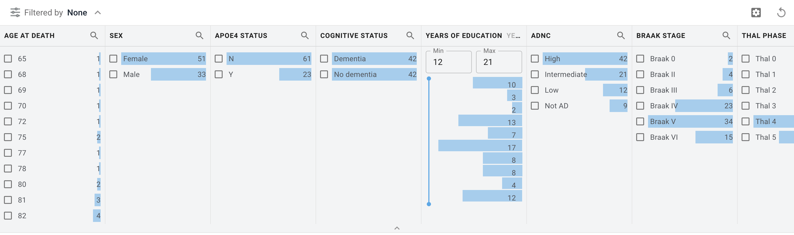

# Allen Institute for Brain Science - Application Team Coding Challenge

This challenge tests capabilities of using GraphQL in React, creating React components, and working within an established codebase. The code you'll see in this repository was taken from a production application and modified for use in this coding challenge.

**Please use Node v16 for best compatibility**

## Getting Started
1. Open this repository in your favorite editor
2. Initialize `git` (`git init`)
3. Commit the initial, unchanged challenge code (`git add -a && git commit -m "initial commit"`)
4. Complete the steps in the [coding challenge](#coding-challenge) section below
5. Timebox work to 1-2 hours
6. Commit your changes once you're happy with your solution or have reached the time limit
7. Delete `node_modules`
8. Zip up the repository folder
9. Upload your zipped solution to a cloud service you have access to and have the ability to share with others (if you don't have access to such a service, please let us know and we'll figure out a solution)
10. Respond to the code challenge instructions email you received from us with the link we can use to download your solution

Happy coding!

# Setup Guide
This project is set up with node version `v16`. Please make sure you're on the latest minor version, as some Node `v16` versions have bugs that can cause problems with the challenge on some operating systems.

To check your node version run the following command in your terminal:
```sh
node -v
```

The [n](https://www.npmjs.com/package/n) npm package is a helpful tool for managing Node.js versions. For those using Windows, [nvm](https://github.com/nvm-sh/nvm) is a good alternative.

As you setup the project and encounter problems, use the [troubleshooting](#troubleshooting) section below. If you solve a problem not documented in the troubleshooting section, please add your solution to the documentation for bonus challenge points!

## Local Development Environment
Install npm packages.

```sh
npm install
```

Once packages are installed, start the dev server.

```sh
npm run start
```

### Local URL
The site will automatically open to `localhost:8080` when you run `npm run start`.

## Setting Environment Variables
This coding challenge uses the following environment variables to configure itself:
- `BKP_URL` - GraphQL API for the Allen Institute Brain Knowledge Platform that provides the data you'll be working with

A `.env` file has been created for you at the root of the project with the correct URL. If the network connection is failing, please reach out to us before continuing further or starting your timer so we can troubleshoot and correct the issue.

## Repository File Structure
A layout of the repository file structure can be found in the [here](./file-structure.md). Any files that are created should follow the correct file-structure and naming conventions.

# Coding Challenge
Below are the requested implementation steps for this coding challenge. Complete as much as you can in one or two hours; there is no need to put in more than a couple hours of focused effort. The requests build upon one another, so start from the top and work your way down. Keep in mind that this is not a zero-sum test, in that your score is not graded as a percentage of anything and there is no expectation that you will complete all of the questions. Instead think of this as a game, like Jeopardy; the goal is simply to rack up the highest number of points possible in the time given.

You will be judged based on your presentation, code quality, and readability. You are encouraged to use every resource at your disposal, including writing code, using libraries, reading textbooks, consulting the internet and browsing scientific literature. Please cite any sources that you use.

Our team predominantly writes code in TypeScript, however, for this coding challenge you are allowed to write your code in JavaScript if you are unfamiliar with TypeScript.

We ask that you do not post the questions in online discussion forums. We also reserve the right to ask you follow-up or modified versions of these questions later on in the interview process.

Partial credit is also available, so please show your work, leave comments, and include in your submission any code you write to solve the problems.

## Challenge Items
1. Create a new type of `FilterColumn` for displaying a list of items and their associated count. The data that feeds into the existing range filter also has the data for powering the list filter. The final result should look similar to the following image:

2. Add a search mechanism to the header of each column that allows the user to find items within the column by hiding items that do not contain the search string
3. Sync the current state of the filter to the URL
4. Use the URL state to populate the initial filter state upon a page refresh

**In addition to writing code**, please identify potential opportunities for improvements that would increase performance, improve readability, enhance the developer experience, or any other benefit that you can think of. In addition, feedback on this coding challenge or the interview process would be welcome.

You can submit your ideas in the response email you send back to us or as comments within the codebase. We will take your comments into consideration in addition to your code as part of the coding challenge evaluation.

# Troubleshooting
Please reach out by email with any questions or issues you face related to this coding challenge.

You can also reference the sections below of common issue that can occur when running this challenge locally.

# `npm run start` Command Hangs
If you're not seeing a "Server running at http://localhost:8080" message or the build never seems to complete, stop the dev server and delete the `.parcel-cache` folder to give it a clean slate for recompiling the challenge

# Hot Module Replacement (HMR) Not Working
Check if there is a [newer version of Parcel](https://www.npmjs.com/package/parcel) and update the `package.json` to use that version. It should be current enough that the HMR works properly, but updating Parcel is one potential solution.

If the HMR still isn't working, please let us know. You can do a hard refresh of the browser tab in the meantime until we get it working again.

# Module Not Found Errors
On Windows there is a bug in Node `v16.14.0` that can cause problems. Make sure you're fully up to date on Node `v16` if you encounter module issues.
